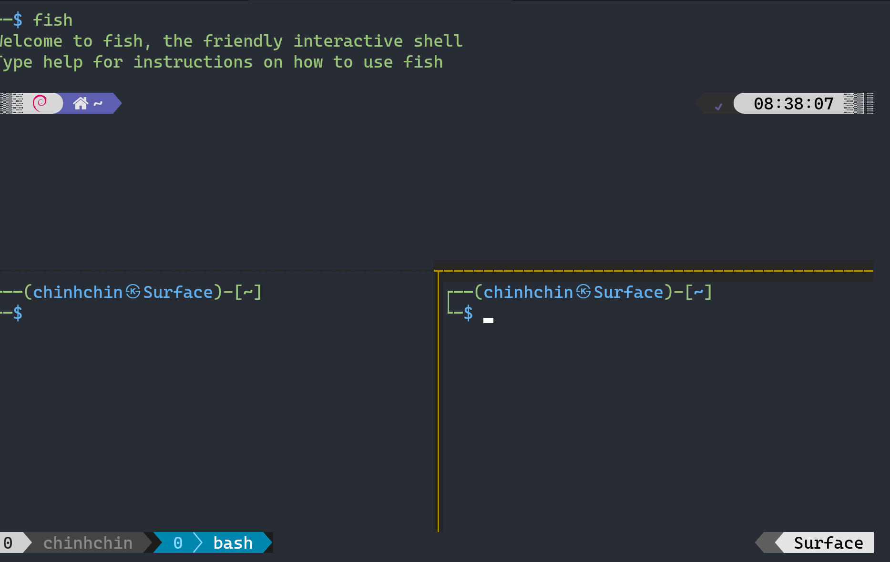

# **My [Tmux](https://github.com/tmux/tmux/wiki) setup**
Tmux is window management for terminal that increase more productivity for me and this is my setup.

### **Image Preview**
- Screenshots


### **Go to**
- [Version record](./version-record.json)

### **Credits**
- Inspiration, list of modules and solution from [craftzdog/dotfiles-public](https://github.com/craftzdog/dotfiles-public).

### **OS support**
- Windows 10, 11 (WSL)
- macOS
- linux

### **Packages requirement**
- [Brew](https://github.com/chinhchin/Brew-setup.git)

### **Contents**
#### 1. [Install Tmux](./readme.md#1-install-tmux)

#### 2. [Add Tmux config file](./readme.md#2-add-tmux-config-files)

#### 3. [Useful Features](./readme.md#3-useful-features)
1. [Alias in Fish Shell](./readme.md#31-alias-in-fish-shell-only-for-fish-shell-who-use-my-fish-shellhttpsgithubcomchinhchinfish-shell-setup-alias)
2. [Basic shortcuts](./readme.md#32-basic-shortcuts)

---

## **1. Install Tmux**
Type ```brew install terminal``` to your terminal to install Tmux.

> **Important**
>
> Make sure that you've already install Brew to your terminal.

## **2. Add Tmux config files**
Copy all files in [home](./home/) directory to your ```~``` directory.

> **Alias**
>
> You can add alias to incerase your productivity in my [Fish Shell setup](https://github.com/chinhchin/Fish-Shell-setup.git).

## **3. Useful features**
### **Source of shortcuts**
You can see many shortcuts in ```~/.tmux.conf``` file after install with my solution.

### **3.1 Alias in Fish Shell** (only for fish shell who use [my fish shell](https://github.com/chinhchin/Fish-Shell-setup) alias)

- **tm** - ```tmux```
- **tmks** - ```tmux kill-session -t```
- **tmat** - ```tmux attach-session -t```
- **tmls** - ```tm ls```

### **3.2 Basic shortcuts**
**Change of prefix key.**
- **\<C-t\>** - (I change prefix key from ```<C-b>``` to ```<C-t>```)

**These shortcut can be used any time**
- **C-S-Left** - move window to left
- **C-S-Right** - move window to right

**These shortcut can be used after start prefix key.**
- **r** - reaload
- **k** - move pane focus to up
- **j** - move pane focus to down
- **h** - move pane focus to left
- **l** - move pane focus to right
