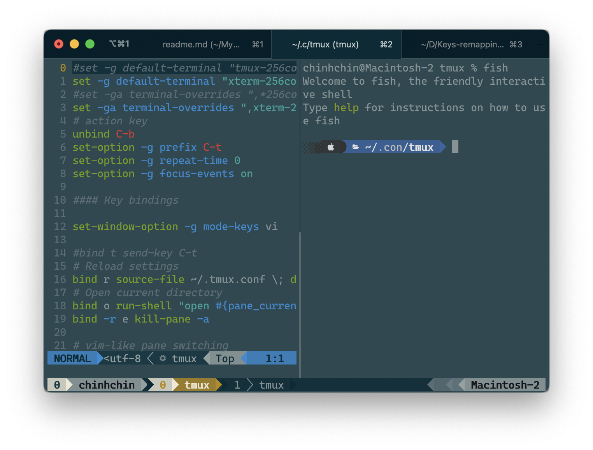

# **My [Tmux](https://github.com/tmux/tmux/wiki) setup**
Tmux is window management for terminal that increase more productivity for me and this is my setup.

### **Image Preview**
- Screenshots


### **See**
- [Versions](./versions.json)

### **Credits**
- Inspiration, list of modules and solution from [craftzdog/dotfiles-public](https://github.com/craftzdog/dotfiles-public).

### **OS support**
- macOS
- linux

### **Packages requirement**
- [Brew](https://github.com/chinhchin/Brew-setup.git)

### **Contents**
#### 1. [Install Tmux](./readme.md#1-install-tmux)

#### 2. [Add Tmux config file](./readme.md#2-add-tmux-config-files)

#### 3. [Useful Features](./readme.md#3-useful-features)
1. [Alias in Fish Shell](./readme.md#31-alias-in-fish-shell-only-for-fish-shell-who-use-my-fish-shellhttpsgithubcomchinhchinfish-shell-setup-alias)
2. [Basic shortcuts](./readme.md#32-basic-shortcuts)

---

## **1. Install Tmux**
Type ```brew install tmux``` to your terminal to install Tmux.

> **Important**
>
> Make sure that you've already install Brew to your terminal.

## **2. Add Tmux config files**
Type these command terminal to auto add tmux folder to *~/.config*.
```
# Check if ~/.config directory is exist.
cd ~
if not test -d ~/.config ; mkdir .config ; end

# Check if ~/Donwloads folder exists.
if not test -d ~/Downloads ; mkdir ~/Downloads ; end

# Clone repository
git clone https://github.com/chinhchin/Tmux-setup.git ~/Downloads/Tmux-setup

# Copy folder
cp -r ~/Downloads/Tmux-setup/tmux/ ~/.config/tmux/
```

## **3. Useful features**
### **Source of shortcuts**
You can see many shortcuts in ```~/.tmux.conf``` file after install with my solution.

### **3.1 Alias in Fish Shell** (only for fish shell who use [my fish shell](https://github.com/chinhchin/Fish-Shell-setup) alias)

- **tm** - ```tmux```
- **tmks** - ```tmux kill-session -t```
- **tmat** - ```tmux attach-session -t```
- **tmls** - ```tm ls```

